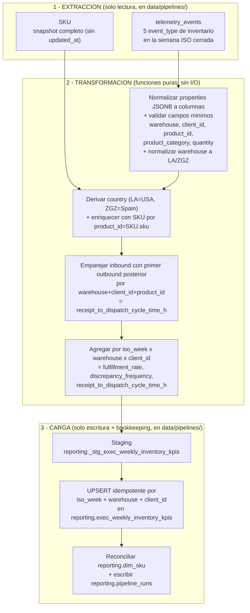

# Telemetría TrackFlow — Diseño del pipeline de reporting ejecutivo

Fecha: 2026-08-28
Tipo: documento de diseño (Fases 1–5). No hay código en esta entrega; el código
llega en la parte de implementación posterior.

Relacionado:
- `CONTEXT-trackflow.md` — CONTEXT de telemetría (5 métricas obligatorias de inventario).
- `Pasos/telemetria-trackflow-resumen.md` — captura frontend (Fases 1–3).
- `Pasos/telemetria-almacenamiento-supabase.md` — persistencia real en `telemetry_events`.
- `Pasos/telemetria-pipeline-analisis-reporte.md` — reporte **técnico** existente (`GET /telemetry/report`).

> **Nota sobre `CONTEXT-company.md`:** ese archivo no existe todavía en el repo.
> Los valores marcados _(derivado)_ se reconstruyeron desde `CONTEXT-trackflow.md`
> y `memory-bank/` (confirmado con el desarrollador):
> - **Rol ejecutivo `[rol]`** = **Thomas Harry, CEO** (dirección ejecutiva).
> - **Cadencia** = **semanal** (`memory-bank/projectbrief.md`: "informe semanal
>   generado automáticamente para la dirección ejecutiva"; hoy se ensambla a mano
>   cada domingo).
> - **KPIs a medir** = tasa de cumplimiento, frecuencia de discrepancias de
>   inventario, tiempo de ciclo recepción→despacho (`memory-bank/progress.md`, Hito 11).
> - **Destination table** = `reporting.exec_weekly_inventory_kpis` _(nombre acordado;
>   reconciliar si aparece `CONTEXT-company.md` con otro literal)_.

---

## Vocabulario de dominio (contrastado con el código del monorepo)

Todo el diseño usa los nombres y valores **reales** que emite hoy la
instrumentación, no un modelo genérico.

| Concepto | Nombre / valores reales | Fuente en el repo |
| --- | --- | --- |
| Evento de recepción | `inbound_order_created` | `inventory-inbound-order-panel.tsx` → `track(...)` |
| Evento de despacho | `outbound_order_created` | `inventory-outbound-order-panel.tsx` |
| Evento de aviso de stock bajo | `stock_threshold_triggered` (se emite si `current_stock <= 10`) | `lib/inventory.ts` → `LOW_STOCK_THRESHOLD = 10` |
| Evento de discrepancia | `inventory_discrepancy_detected` | `event-shcemas.json` (aún **no cableado**) |
| Evento de edición directa rechazada | `direct_stock_edit_rejected` | `event-shcemas.json` (aún **no cableado**) |
| `properties.warehouse` | **`"LA"` \| `"ZGZ"`** (valor de `SKU.warehouse`) | `lib/inventory.ts` → `InventoryWarehouse = "LA" \| "ZGZ"`; panel emite `selectedProduct.warehouse` |
| `properties.client_id` | Cadena con el **nombre de marca** (`SKU.client_name`) — el modelo no tiene id de cliente separado | panel emite `client_id: selectedProduct.client_name`; documentado en `telemetria-trackflow-resumen.md` |
| `properties.product_id` | **Código de SKU** (`SKU.sku`, p. ej. `CLT-SNK-W-42-Z`) | panel emite `product_id: selectedProduct.sku` |
| `properties.product_category` | **`"fashion"` \| `"electronics"` \| `"cosmetics"`** (`SKU.category`) | `lib/inventory.ts` → `InventoryCategory` |
| `properties.quantity` | entero (unidades del movimiento) | panel |
| Tabla de SKUs | `SKU(id, name, sku, client_name, category, warehouse)` — **sin `updated_at`** | `services/incidents-api/models.py` |
| Recepciones | `StockEntry(id, sku_id→sku.id, quantity, reference, warehouse, created_at, user_uuid)` | `models.py` |
| Despachos / pérdidas | `StockExit(id, sku_id→sku.id, quantity, exit_type, tracking_number, warehouse, created_at, user_uuid)`; `exit_type ∈ {"dispatch","loss"}` | `models.py` / `lib/inventory.ts` |
| Log de eventos | `telemetry_events(event_id PK, timestamp, session_id, user_id, event_type, schema_version, request_id, properties JSONB)` | `models.py` → `TelemetryEventRecord` |
| País | `USA` \| `Spain` (`models.py` → `VALID_COUNTRIES`); mapeo `LA→USA`, `ZGZ→Spain` | `CONTEXT.md`, `models.py` |

> **Desviación conocida spec vs. implementación:** `CONTEXT-trackflow.md` y
> `event-shcemas.json` prescriben `warehouse ∈ {los_angeles, zaragoza}` y
> `client_id` opaco. La instrumentación real emite `{LA, ZGZ}` y `client_id` con
> el nombre de marca. **El pipeline se diseña contra lo que llega de verdad**
> (`LA`/`ZGZ`, `client_name`) y normaliza a esos valores; si más adelante se
> alinea la instrumentación con la spec, solo cambia el paso de normalización.

---

# Fase 1 — Análisis del estado actual

## 1.1 Estado Actual

### Eventos de telemetría capturados hasta ahora

Instrumentados y persistiendo de verdad en `telemetry_events` (ver
`telemetria-trackflow-resumen.md`, 13 de 15 tipos cableados):

| Grupo | `event_type` | Origen |
| --- | --- | --- |
| Inventario (negocio) | `inbound_order_created` | `inventory-inbound-order-panel.tsx` |
| Inventario (negocio) | `outbound_order_created` | `inventory-outbound-order-panel.tsx` |
| Inventario (negocio) | `stock_threshold_triggered` | ambos paneles, tras crear la orden, si `current_stock <= 10` |
| Inventario (negocio) | `inventory_discrepancy_detected` | **no cableado** — no hay detección automática todavía |
| Inventario (negocio) | `direct_stock_edit_rejected` | **no cableado** — no existe edición directa de stock |
| Auth | `auth_login_attempted` / `_succeeded` / `_failed`, `session_expired`, `protected_route_redirected` | `lib/auth-context.tsx`, `components/auth-guard.tsx` |
| Rendimiento / navegación | `route_changed`, `page_load_completed` | `components/route-tracker.tsx` |
| Técnico | `api_latency_recorded`, `api_request_failed`, `frontend_error_captured` | `timedFetch()`, listeners globales |

Envelope por evento: `event_id`, `timestamp`, `session_id`, `user_id`,
`event_type`, `schema_version`, `request_id`, `properties` (JSONB).
Campos en `properties` de los eventos de inventario: `warehouse` (`LA`/`ZGZ`),
`client_id` (nombre de marca), `product_id` (código SKU), `product_category`
(`fashion`/`electronics`/`cosmetics`), `quantity`.

### Dónde se almacenan

- **Tabla:** `telemetry_events` en Supabase (PostgreSQL), `models.py`
  (`TelemetryEventRecord`, SQLModel). PK `event_id` (UUID). Índices: btree en
  `timestamp`, btree en `event_type`, GIN en `properties`.
- **Naturaleza:** **insert-only e inmutable**. Ningún router hace UPDATE/DELETE.
  Ingesta: `POST /telemetry/events` (bulk insert con rechazo parcial).
- **Tablas de dominio (Hito 05, misma BD):** `SKU`, `StockEntry`, `StockExit`.
  Stock **derivado**: `SUM(StockEntry.quantity) − SUM(StockExit.quantity)` por
  `warehouse`, nunca almacenado.

### Qué responde ya el reporte técnico existente

`GET /telemetry/report` (`services/incidents-api/routers/telemetry.py`) +
pipeline puro `services/incidents-api/telemetry/analysis.py`:

| Dimensión | Función | Qué responde |
| --- | --- | --- |
| Volumen | `compute_event_volume` | nº de eventos totales y por `event_type` en la ventana |
| Errores | `compute_error_rate` | tasa de `api_request_failed` + `auth_login_failed` + `frontend_error_captured` |
| Latencia | `compute_latency_percentiles` | `mean`/`p50`/`p95`/`p99` de `latency_ms` por `endpoint` |
| Disponibilidad | `compute_availability` | % de respuestas no-5xx por `endpoint` |

Respuesta: `{ period:{from,to}, metrics:{volume,errors,latency,availability} }`.
Ventana por defecto: últimos 7 días. **Audiencia:** equipo técnico (Andrés Kim,
CTO). El docstring de `analysis.py` lo dice: *"Deliberadamente NO se calculan
métricas de negocio"*.

## 1.2 La brecha

El reporte técnico responde *"¿la plataforma está sana?"*. **No responde ninguna
pregunta de negocio de inventario.**

Pregunta de `CONTEXT-company.md` _(derivado)_ sin respuesta automatizada:

> **"¿Cómo evolucionan, semana a semana y comparando `LA` vs `ZGZ` (y por marca),
> la tasa de cumplimiento, la frecuencia de discrepancias de inventario y el
> tiempo de ciclo recepción→despacho?"**

Hoy esto se ensambla **a mano cada domingo** por los directores
(`projectbrief.md`). El reporte técnico no sirve porque:

1. Ignora los eventos de inventario.
2. Agrega por `endpoint` / `event_type`, no por `warehouse` / `client_id` / país.
3. No cruza eventos entre sí (el cycle time necesita **emparejar** un
   `inbound_order_created` con su `outbound_order_created` posterior del mismo SKU).
4. Su cadencia es "7 días rodantes bajo demanda", no un **consolidado semanal
   estable** citable en un comité.
5. No persiste resultados: recalcula en cada llamada; el informe ejecutivo
   necesita **serie histórica** semana a semana.

→ Se necesita un **pipeline dedicado** de extracción → transformación → carga.

---

# Fase 2 — Diseño del pipeline

## 2.1 Propósito (una frase)

> **Producir `reporting.exec_weekly_inventory_kpis`, el consolidado semanal por
> `warehouse` (`LA`/`ZGZ`) / `client_id` / país que alimenta el informe
> ejecutivo del CEO (Thomas Harry) con cadencia semanal, calculando tres KPIs —
> tasa de cumplimiento, frecuencia de discrepancias de inventario y tiempo de
> ciclo recepción→despacho — a partir de los eventos obligatorios de inventario
> de `CONTEXT-trackflow.md`.**

- **Entregable de negocio:** el consolidado semanal que sustituye el ensamblado
  manual de los domingos.
- **KPIs** (sección "KPIs a medir" _(derivado)_): `fulfillment_rate`,
  `discrepancy_frequency`, `receipt_to_dispatch_cycle_time_h`.
- **Métricas obligatorias de telemetría de origen** (`CONTEXT-trackflow.md` §3):
  `inbound_order_created`, `outbound_order_created` → volumen y cycle time ·
  `stock_threshold_triggered` → penaliza `fulfillment_rate` ·
  `inventory_discrepancy_detected` → numerador de `discrepancy_frequency` ·
  `direct_stock_edit_rejected` → señal de control secundaria (`governance_flags`).

### Definición operativa de cada KPI

Grano: `(iso_week, warehouse, client_id)`, con `warehouse ∈ {LA, ZGZ}` y
`country` derivado (`LA→USA`, `ZGZ→Spain`).

| KPI | Fórmula | Eventos |
| --- | --- | --- |
| `fulfillment_rate` | `Σ quantity(outbound_order_created) / (Σ quantity(outbound_order_created) + Σ quantity(stock_threshold_triggered))` | `outbound_order_created`, `stock_threshold_triggered` |
| `discrepancy_frequency` | `count(inventory_discrepancy_detected) / (count(inbound_order_created) + count(outbound_order_created)) * 1000` (discrepancias por 1.000 movimientos) | `inventory_discrepancy_detected`, `inbound_order_created`, `outbound_order_created` |
| `receipt_to_dispatch_cycle_time_h` | mediana de horas entre un `inbound_order_created` y el **primer** `outbound_order_created` posterior con el mismo `(warehouse, client_id, product_id)` dentro de la ventana | `inbound_order_created`, `outbound_order_created` |

## 2.2 Formato de extracción

| Fuente | Formato | Frecuencia de actualización | Extracción |
| --- | --- | --- | --- |
| `telemetry_events` (Supabase) — **principal** | Filas Postgres: envelope en columnas + `properties` JSONB. Se filtran los 5 `event_type` de inventario (`event_type = ANY(...)`) y se normaliza `properties` a columnas. | Ingesta continua vía `POST /telemetry/events`. Eventos de inventario = **stream** (< 1 min) según `telemetry-plan.md` §3.4. El pipeline no necesita tiempo real: lee la **semana ISO ya cerrada**. | `SELECT ... FROM telemetry_events WHERE timestamp >= :week_start AND timestamp < :week_end AND event_type IN (...)` |
| `SKU` (dominio, misma BD) — **enriquecimiento** | Filas Postgres: `id, name, sku, client_name, category, warehouse`. **No tiene `updated_at` ni borrado lógico.** Tabla pequeña (8–15 filas). | Mutable: se edita en sitio bajo el mismo `id` (cambia `category`, `client_name`, `warehouse`). | **Snapshot completo cada corrida** (`SELECT * FROM sku`). Ver 2.4. |
| `StockEntry` / `StockExit` (dominio) — **control de calidad opcional** | Filas Postgres append-only; `created_at`, `warehouse`, `quantity`, `exit_type`. | Append-only. | `SELECT` por `created_at` en la ventana, para contrastar que el volumen de eventos cuadra con los movimientos reales (no es KPI). |

**Ventana de proceso:** semana ISO completa y cerrada
`[lunes 00:00:00Z, lunes siguiente 00:00:00Z)`. La corrida del lunes procesa la
semana recién terminada.
**Join de enriquecimiento:** `properties.product_id` ↔ `SKU.sku` (código);
aporta `SKU.id`, `SKU.category` canónica y `SKU.name` legible.

## 2.3 Flujo de datos



Tres etapas separadas: **extracción** (I/O de lectura, sin lógica de KPI),
**transformación** (funciones puras sobre DataFrames, sin I/O), **carga** (I/O de
escritura + bookkeeping). Toda esta lógica vive en `data/pipelines/` (Fase 5).

## 2.4 Fuente que actualiza registros existentes (evitar duplicados)

`telemetry_events` es append-only → sin problema ahí. El caso real de "la fuente
actualiza registros en vez de insertar siempre" es la tabla **`SKU`** (se edita
en sitio bajo el mismo `id`, y **no tiene `updated_at`** para detectar cambios) y
la **propia tabla de destino** cuando una semana se recalcula.

**Estrategia concreta:**

1. **`SKU`: snapshot completo + UPSERT por PK + marca de vigencia.**
   Sin `updated_at` no hay extracción incremental fiable, y la tabla es diminuta,
   así que cada corrida lee `SELECT * FROM sku` entero y lo vuelca en
   `reporting.dim_sku` con:
   `INSERT ... ON CONFLICT (sku_id) DO UPDATE SET name=…, client_name=…, category=…, warehouse=…, is_current=true, seen_at=now()`.
   Tras el volcado, `UPDATE reporting.dim_sku SET is_current=false WHERE sku_id NOT IN (ids del snapshot)` → captura SKUs eliminados/renombrados sin borrar histórico.
   Nunca se duplica un SKU porque la clave es `sku_id` (= `SKU.id`, PK estable).

2. **Tabla de hechos: idempotencia por clave natural.**
   Clave de negocio de `reporting.exec_weekly_inventory_kpis` =
   `(iso_week, warehouse, client_id)`. La carga hace
   `INSERT ... ON CONFLICT (iso_week, warehouse, client_id) DO UPDATE SET ...`.
   Reprocesar la misma semana **sobrescribe** esa fila; nunca crea una segunda.

3. **Deduplicación de eventos de origen.**
   Aunque `telemetry_events` tiene PK en `event_id`, la transformación hace un
   `drop_duplicates(subset=["event_id"])` defensivo tras normalizar.

4. **Late-arriving events.** Cada corrida semanal reprocesa también la semana
   **anterior** (ventana de gracia de 7 días) con el mismo UPSERT: si llegaron
   eventos tarde, esa fila se corrige sola sin duplicar.

## 2.5 Tabla de destino (esquema `reporting`)

**`reporting.exec_weekly_inventory_kpis`** — un registro por
`(iso_week, warehouse, client_id)`.

| Columna | Tipo | Origen |
| --- | --- | --- |
| `iso_week` | `text` (`2026-W35`) | ventana de proceso |
| `week_start` / `week_end` | `timestamptz` | ventana de proceso |
| `warehouse` | `text` (`LA` \| `ZGZ`) | `properties.warehouse` normalizado |
| `country` | `text` (`USA` \| `Spain`) | derivado de `warehouse` |
| `client_id` | `text` (nombre de marca, `SKU.client_name`) | `properties.client_id` |
| `inbound_orders` / `outbound_orders` | `int` | conteo de eventos |
| `inbound_qty` / `outbound_qty` | `numeric` | `Σ properties.quantity` |
| `stock_threshold_events` | `int` | conteo `stock_threshold_triggered` |
| `discrepancy_events` | `int` | conteo `inventory_discrepancy_detected` |
| `governance_flags` | `int` | conteo `direct_stock_edit_rejected` |
| `fulfillment_rate` | `numeric(5,4)` | KPI 1 |
| `discrepancy_frequency` | `numeric` | KPI 2 (por 1.000 movimientos) |
| `receipt_to_dispatch_cycle_time_h` | `numeric` | KPI 3 (mediana de horas) |
| `events_considered` | `int` | trazabilidad |
| `pipeline_run_id` | `uuid` | corrida que escribió/actualizó la fila |
| `computed_at` | `timestamptz` | `now()` en la carga |

`PRIMARY KEY (iso_week, warehouse, client_id)`.

Tablas de soporte del mismo esquema: `reporting.dim_sku` (dimensión SKU
reconciliada) y `reporting.pipeline_runs` (log de ejecución, Fase 3).

**Explícitamente separada de:**
- `telemetry_events` — log crudo e inmutable de eventos; esto es un agregado de
  negocio derivado.
- `GET /telemetry/report` — salud técnica bajo demanda (latencia/errores); esto
  son KPIs de inventario persistidos y versionados semana a semana.

---

# Fase 3 — Resiliencia e idempotencia

## 3.1 Estrategia de idempotencia (fallo durante la carga + re-run)

Objetivo: si el pipeline peta a mitad de la carga y se relanza, **ni se corrompen
ni se duplican** los datos ya cargados.

1. **Escritura a staging primero, nunca directa a la tabla final.**
   La transformación escribe el DataFrame completo a
   `reporting._stg_exec_weekly_inventory_kpis` con `TRUNCATE` + `INSERT` (staging
   desechable y privada del pipeline).

2. **Promoción staging → final en una única transacción.**
   ```sql
   BEGIN;
   INSERT INTO reporting.exec_weekly_inventory_kpis AS t (...)
   SELECT ... FROM reporting._stg_exec_weekly_inventory_kpis
   ON CONFLICT (iso_week, warehouse, client_id) DO UPDATE SET
       fulfillment_rate = EXCLUDED.fulfillment_rate,
       discrepancy_frequency = EXCLUDED.discrepancy_frequency,
       receipt_to_dispatch_cycle_time_h = EXCLUDED.receipt_to_dispatch_cycle_time_h,
       inbound_orders = EXCLUDED.inbound_orders,
       outbound_orders = EXCLUDED.outbound_orders,
       ... ,
       pipeline_run_id = EXCLUDED.pipeline_run_id,
       computed_at = now();
   COMMIT;
   ```
   Si el proceso muere antes del `COMMIT`, Postgres revierte: la tabla final
   queda **exactamente como estaba**. Si muere después, los datos ya están bien y
   un re-run repite el mismo UPSERT con idéntico resultado.

3. **Clave natural, no autoincremental.** `(iso_week, warehouse, client_id)`
   garantiza actualización en sitio. No hay `id serial` que genere fila nueva por
   corrida.

4. **El resultado es función pura de la ventana.** Las funciones de
   transformación reciben `(events_df, sku_df, week_start, week_end)`, no mutan la
   entrada y no dependen de la hora de ejecución → correr `2026-W35` hoy o dentro
   de un mes da el mismo output.

5. **La reconciliación de `reporting.dim_sku` es un UPSERT por `sku_id`**: correrla
   dos veces deja la dimensión igual.

6. **Un `run_id` (UUID) por corrida**, estampado en cada fila que escribe. Detecta
   promociones a medias (filas de la misma semana con `run_id` distinto → alerta).

## 3.2 Log de ejecución — `reporting.pipeline_runs`

Una fila por corrida.

| Campo | Tipo | Por qué es necesario para auditar en producción |
| --- | --- | --- |
| `run_id` | `uuid` (PK) | Identificador único; se cruza con `pipeline_run_id` de la tabla de KPIs para saber qué corrida produjo cada dato. |
| `pipeline_name` | `text` (`exec_weekly_inventory_kpis`) | Distinguir este pipeline de otros que compartan la tabla de logs. |
| `pipeline_version` | `text` | Versión del código de transformación. Si un KPI cambia entre semanas, saber si fue por datos o por cambio de fórmula. |
| `trigger` | `text` (`scheduled` \| `manual` \| `backfill`) | Separar reprocesos manuales de la cadencia normal. |
| `triggered_by` | `text` | Usuario/sistema que lanzó un `manual`/`backfill` (`"prefect"` para `scheduled`). Responsabilidad. |
| `window_from` / `window_to` | `timestamptz` | Ventana ISO exacta procesada. Sin esto no se puede reproducir ni verificar una corrida. |
| `iso_week` | `text` | Semana de negocio, en el mismo formato que la tabla de KPIs, para join directo. |
| `sku_snapshot_rows` | `int` | Nº de filas leídas de `SKU`. Un desplome = problema en la BD de dominio. |
| `sku_rows_deactivated` | `int` | SKUs marcados `is_current=false` en esta corrida. Un pico = borrados/renombrados masivos que hay que revisar. |
| `started_at` / `finished_at` | `timestamptz` | Duración real. Detectar degradación y corridas colgadas (`started` sin `finished`). |
| `status` | `text` (`running` \| `completed` \| `failed`) | Estado terminal. `running` viejo = zombi. Nada aguas abajo debe fiarse de una semana cuyo último run no sea `completed`. |
| `rows_read` | `int` | Eventos de inventario leídos de `telemetry_events` en la ventana. Caída brusca vs. semanas previas = fallo de ingesta upstream. |
| `rows_rejected` | `int` | Eventos descartados por faltar campos mínimos (`warehouse`, `client_id`, `product_id`, `product_category`, `quantity`). > 0 sostenido = regresión en la instrumentación. |
| `rows_unmatched_sku` | `int` | Eventos cuyo `product_id` no casó con ningún `SKU.sku`. Indica SKUs borrados o `product_id` mal emitido. |
| `rows_transformed` | `int` | Filas de KPI resultantes (`iso_week × warehouse × client_id`). Sanity check del fan-in. |
| `rows_upserted_insert` / `rows_upserted_update` | `int` | Filas nuevas vs. actualizadas en la tabla final. Muchos `update` = reproceso o late-arriving masivo. |
| `error_count` | `int` | Errores no fatales capturados en la transformación (p. ej. SKU sin categoría). |
| `error_message` | `text` (nullable) | Mensaje + tipo de excepción de la causa del `failed`. Primer dato para el on-call. Sin stack completo (misma política que `frontend_error_captured`). |
| `error_sample` | `jsonb` (nullable) | Hasta N ejemplos anonimizados de filas rechazadas (`event_id`, `event_type`, campo ausente). Diagnóstico sin volver a los datos crudos. |

Reglas: la fila se crea con `status = running` al empezar (una corrida que muere
deja rastro); se cierra a `completed`/`failed` con todos los contadores.
`GET /reporting/exec-weekly/status` lee esta tabla.

---

# Fase 4 — Mapeo a Prefect

Todo el código de orquestación y ETL vive en
**`data/pipelines/exec-weekly-inventory-kpis/`** (ver Fase 5). `services/` no
contiene lógica de ETL.

```
data/pipelines/exec-weekly-inventory-kpis/
  flow.py         # flows + tasks de Prefect
  extract.py      # extract_inventory_events(), extract_sku_snapshot()
  transform.py    # funciones puras: normalize_events(), pair_receipt_dispatch(), aggregate_weekly_kpis()
  load.py         # stage_kpis(), promote_kpis(), reconcile_dim_sku(), open_run()/close_run()
  queries.py      # read_latest_run(), query_weekly_kpis()  -> las usa services/reporting
  schema.sql      # DDL de reporting.exec_weekly_inventory_kpis, reporting.dim_sku, reporting.pipeline_runs
  blocks.py       # carga de Prefect blocks
```

## 4.1 Flow y tasks

**Flow principal:** `exec_weekly_inventory_kpis_flow(iso_week: str | None = None, trigger: str = "scheduled")`
(en `flow.py`). Si `iso_week` es `None`, calcula la última semana ISO cerrada.

| Task (`data/pipelines/exec-weekly-inventory-kpis/`) | Etapa | Entrada → Salida | Retries |
| --- | --- | --- | --- |
| `extract.extract_inventory_events` | **Extracción** | `(week_start, week_end)` → DataFrame de los 5 `event_type` de inventario desde `telemetry_events` | 3, backoff exponencial (fallos transitorios de Supabase) |
| `extract.extract_sku_snapshot` | **Extracción** | `()` → DataFrame con `SELECT * FROM sku` | 3, backoff exponencial |
| `transform.build_weekly_kpis` | **Transformación** | `(events_df, sku_df, week_start, week_end)` → DataFrame `iso_week × warehouse × client_id` con los 3 KPIs. Internamente: `normalize_events` → `pair_receipt_dispatch` → `aggregate_weekly_kpis` | 0 (función pura; si falla es un bug, no reintentar) |
| `load.load_weekly_kpis` | **Carga** | `kpis_df` → `stage_kpis` + `promote_kpis` (UPSERT transaccional) + `reconcile_dim_sku`; devuelve `(inserted, updated)` | 2 (reintento seguro: es idempotente) |
| `load.finalize_run` | Bookkeeping | contadores + `status` → cierra la fila de `reporting.pipeline_runs` | 2 |

Mínimo cumplido: **1 flow principal + 5 tasks** (extracción ×2, transformación,
carga, finalize). La separación extracción / transformación / carga es 1:1 con
las tasks. `finalize_run` se engancha con `on_completion` / `on_failure` del flow
para registrar también cuando una task revienta.

### States relevantes

| State de Prefect | Cuándo | Significado de negocio |
| --- | --- | --- |
| `Running` | Flow/task en ejecución | El consolidado de la semana **aún no está listo**; el dashboard ejecutivo debe esperar. `pipeline_runs.status = running`. |
| `Completed` | Todas las tasks OK | `reporting.exec_weekly_inventory_kpis` tiene la semana cerrada y correcta; `GET /reporting/exec-weekly/kpis` sirve datos definitivos. |
| `Failed` | Una task agotó sus retries | La semana **no** se actualizó (transacción revertida). On-call revisa `pipeline_runs.error_message`. Re-lanzar es seguro (idempotente). |

(`Retrying`, `Crashed`, `Cancelled` se usan tal cual los da Prefect.)

### Segundo flow (opcional en esta parte)

`exec_weekly_inventory_kpis_backfill_flow(from_week, to_week)` — recorre un rango
de semanas ISO llamando al flow principal por cada una con `trigger="backfill"`.
Sirve para el primer arranque (histórico) o para reprocesar tras un cambio de
fórmula. La Parte 3 subirá el listón dividiendo extract/transform/load en
**subflows**.

## 4.2 Configuración y credenciales como Prefect blocks

| Block | Tipo | Contenido | Uso |
| --- | --- | --- | --- |
| `trackflow-supabase` | `SqlAlchemyConnector` | Connection string de Supabase (host, puerto pooler, db, user, password) | Lectura de `telemetry_events` y `sku`; escritura en el esquema `reporting`. Hoy vive en `services/incidents-api/.env` (ya fuera de git); en Prefect pasa a ser un block. |
| `trackflow-supabase-password` | `Secret` | Solo la password, si se separa del resto | Inyectada en el connector. |
| `reporting-pipeline-config` | `JSON` / `Variable` | `{ "grace_window_days": 7, "error_sample_size": 20, "timezone": "UTC", "week_scheme": "iso", "low_stock_threshold": 10 }` | Parámetros no secretos, versionables sin tocar código. |
| `ops-alert-webhook` | `Secret` / `Webhook` | URL del webhook de alertas (Slack del equipo técnico) | Notificar en `Failed` o si `rows_rejected` supera umbral. |

Los blocks se referencian por nombre (`SqlAlchemyConnector.load("trackflow-supabase")`),
nunca se hardcodean credenciales ni se leen de un `.env` versionado.

---

# Fase 5 — Integración con la aplicación (solo diseño)

## 5.1 Nuevo servicio: `services/reporting/`

App FastAPI independiente (sibling de `services/incidents-api/`), registrada en
`docker-compose.yml`. Es una **capa HTTP fina**: valida query params, llama a una
función o dispara un flow de `data/pipelines/`, y serializa la respuesta.
**No importa nada de `services/incidents-api/telemetry/`, no lee
`telemetry_events`, no calcula KPIs y no toca `GET /telemetry/report`.**

```
services/reporting/
  main.py                 # FastAPI app; registra el router
  routers/reporting.py    # los 3 endpoints, sin lógica de negocio
  schemas.py              # modelos Pydantic de request/response
```

### Los tres endpoints

| Endpoint | Qué hace | Consumidor |
| --- | --- | --- |
| `GET /reporting/exec-weekly/status` | Devuelve la última corrida del pipeline: `run_id`, `pipeline_version`, `iso_week`, `status`, `started_at`, `finished_at`, `rows_read`, `rows_rejected`, `rows_unmatched_sku`. Un solo `SELECT` sobre `reporting.pipeline_runs`. | Panel de operación / health-check del propio dashboard (saber si la semana ya está lista). |
| `POST /reporting/exec-weekly/run` | **Disparo manual**. Body opcional `{ "iso_week": "2026-W35" }`. Lanza el flow de Prefect de forma **asíncrona** (deployment run), inserta una fila `running` en `reporting.pipeline_runs` y responde `202 Accepted` con `{ "run_id": "..." }`. No ejecuta ETL en el proceso web. Idempotente por la clave natural de la tabla de hechos. | Un director que quiere refrescar el consolidado antes del comité; reproceso puntual tras corregir datos. |
| `GET /reporting/exec-weekly/kpis` | **Feed que consume el dashboard de la Parte 3.** Query params: `from_week`, `to_week`, `warehouse` (`LA`/`ZGZ`), `country` (`USA`/`Spain`), `client_id`. Devuelve filas de `reporting.exec_weekly_inventory_kpis` (los 3 KPIs + contadores de soporte). Solo lectura; nunca recalcula ni lee eventos crudos. | Dashboard ejecutivo (Parte 3) + generador del informe semanal del CEO. |

### Separación explícita respecto a lo existente

- **vs. `services/incidents-api/telemetry/` y `GET /telemetry/report`:** aquello
  es ingesta de eventos + salud técnica bajo demanda, en otra app. `services/reporting/`
  es un servicio nuevo que solo expone la tabla `reporting.*`. No comparten
  router, modelos ni acceso a `telemetry_events`.
- **vs. `data/pipelines/`:** todo el ETL (extracción, normalización, emparejado,
  agregación, UPSERT, reconciliación de dimensión) está en
  `data/pipelines/exec-weekly-inventory-kpis/`. `services/reporting/` solo lo
  invoca.

## 5.2 Qué función o flow de `data/pipelines/` llama cada endpoint

| Endpoint | Llama a | Módulo | Tipo | Nota |
| --- | --- | --- | --- | --- |
| `GET /reporting/exec-weekly/status` | `read_latest_run(pipeline_name="exec_weekly_inventory_kpis")` | `data/pipelines/exec-weekly-inventory-kpis/queries.py` | función de solo lectura | Encapsula el `SELECT ... ORDER BY started_at DESC LIMIT 1` sobre `reporting.pipeline_runs`. Vive con el pipeline porque el pipeline es el dueño del esquema de esa tabla. |
| `POST /reporting/exec-weekly/run` | `exec_weekly_inventory_kpis_flow(iso_week=..., trigger="manual")` | `data/pipelines/exec-weekly-inventory-kpis/flow.py` | flow de Prefect | El endpoint lo lanza como *deployment run* asíncrono (`run_deployment(...)`), no lo ejecuta en el request. Devuelve el `run_id` que el flow escribe en `reporting.pipeline_runs`. |
| `GET /reporting/exec-weekly/kpis` | `query_weekly_kpis(from_week, to_week, warehouse, country, client_id)` | `data/pipelines/exec-weekly-inventory-kpis/queries.py` | función de solo lectura | Encapsula el `SELECT` filtrado sobre `reporting.exec_weekly_inventory_kpis`. Devuelve `list[WeeklyInventoryKpiRow]`. Ninguna agregación en vivo: los KPIs ya están materializados. |

Regla transversal: **ninguna lógica de ETL pertenece a `services/`**. Si un
endpoint necesitara un cálculo nuevo sobre los eventos, ese cálculo se añade como
función de transformación en `data/pipelines/.../transform.py` y se materializa en
la tabla, no en el router.

---

# Checklist de la entrega

## Fase 1
- [x] Sección "Estado Actual": eventos capturados, dónde se almacenan, qué responde el reporte técnico.
- [x] Brecha: pregunta de negocio del CONTEXT sin responder + por qué necesita pipeline dedicado.

## Fase 2
- [x] Propósito en una frase (entregable + KPIs + métricas obligatorias de origen).
- [x] Formato de extracción (`telemetry_events` + `SKU` sin `updated_at` + `StockEntry`/`StockExit`; formato; frecuencia).
- [x] Flujo de datos en Mermaid con extracción / transformación / carga separadas.
- [x] Estrategia para fuente que actualiza registros (`SKU` snapshot + UPSERT por `sku_id` + `is_current`; hechos por clave natural + ventana de gracia).
- [x] Tabla destino `reporting.exec_weekly_inventory_kpis`, separada de `telemetry_events` y `GET /telemetry/report`.

## Fase 3
- [x] Idempotencia ante fallo en carga + re-run (staging + UPSERT transaccional + clave natural + reconciliación por PK).
- [x] Log de ejecución `reporting.pipeline_runs`: campos mínimos + justificación de cada campo.

## Fase 4
- [x] 1 flow principal + 5 tasks (extract ×2 / transform / load / finalize); states Running/Completed/Failed explicados.
- [x] Segundo flow (backfill) marcado como opcional.
- [x] Config y credenciales como Prefect blocks.
- [x] Todo el ETL ubicado en `data/pipelines/exec-weekly-inventory-kpis/`.

## Fase 5
- [x] Tres endpoints en `services/reporting/` esbozados: `GET /exec-weekly/status`, `POST /exec-weekly/run`, `GET /exec-weekly/kpis` (feed del dashboard de la Parte 3).
- [x] Separación explícita de `services/incidents-api/telemetry/` y `GET /telemetry/report`.
- [x] Para cada endpoint, la función o flow de `data/pipelines/` que invoca (`read_latest_run`, `exec_weekly_inventory_kpis_flow`, `query_weekly_kpis`).
- [x] Regla: ninguna lógica de ETL en `services/`.

---

# Pendiente / siguientes pasos

1. Reconciliar los valores _(derivado)_ contra `CONTEXT-company.md` real si aparece
   (rol, literal exacto de "Destination table", redacción de "KPIs a medir").
2. Cablear los 2 eventos de inventario que faltan
   (`inventory_discrepancy_detected`, `direct_stock_edit_rejected`) — sin ellos,
   `discrepancy_frequency` y `governance_flags` salen siempre a cero
   (ver `telemetria-trackflow-resumen.md` → "Eventos NO cableados").
3. Decidir si se alinea la instrumentación con la spec (`warehouse`
   `los_angeles`/`zaragoza`, `client_id` opaco) o se deja `LA`/`ZGZ` +
   `client_name`. El pipeline funciona con ambas; solo cambia la normalización.
4. Implementación (parte siguiente): crear `data/pipelines/exec-weekly-inventory-kpis/`,
   el esquema `reporting`, `services/reporting/` y el deployment de Prefect.
5. Reactivar el proyecto Supabase pausado (bloqueo heredado de
   `telemetria-pipeline-analisis-reporte.md`) para probar con datos reales.
