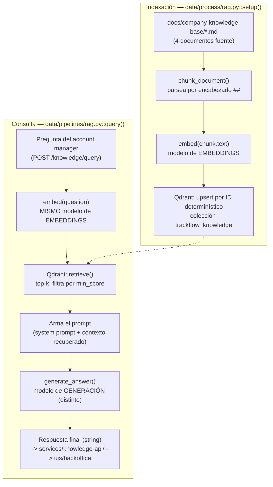

# Diseño del RAG de TrackFlow (Hito 7)

Este documento describe el stack RAG completo de TrackFlow — de extremo a
extremo, desde los documentos fuente hasta la respuesta final — para que
otro desarrollador pueda entenderlo sin tener que leer el código. Implementa
`CONTEXT/CONTEXT7.md`. Ver `Pasos/rag-knowledge-base-fase1.md` para el
detalle completo de la entrega (Fases 1-5b) y cómo se verificó cada pieza.

## Alcance

| Responsabilidad | Ubicación | Estado |
| --- | --- | --- |
| Corpus de conocimiento | `docs/company-knowledge-base/` | ✅ Hecho |
| Chunking + indexación (Fase 1) | `data/process/rag.py` | ✅ Hecho |
| Recuperación + generación (Fase 2) | `data/pipelines/rag.py` | ✅ Hecho |
| Endpoint HTTP (Fase 3) | `services/knowledge-api/` — `POST /knowledge/query` | ✅ Hecho |
| UI de consulta (Fase 4) | `uis/backoffice/src/app/(protected)/knowledge/` | ✅ Hecho |
| Pruebas unitarias (Fase 5) | `tests/pipelines/test_rag.py` (17 tests) | ✅ Hecho |
| Eval de retrieval / Recall@3 (Fase 5b) | `data/eval/evaluate_retrieval.py` | ✅ Hecho (con salvedad, ver más abajo) |
| Documento de diseño RAG (Fase 6) | `docs/rag/rag-design.md` (este archivo) | ✅ Hecho |

No implementado (fuera del alcance de la guía): el agente LangGraph
mencionado como "proyecto posterior" en la Fase 2 de `CONTEXT7.md`.

---

## 1. Proceso RAG de extremo a extremo

Dos flujos separados — **indexación** (una vez por cambio de documento
fuente) y **consulta** (una vez por pregunta de un account manager) —
comparten una sola pieza: `embed()`.



Paso a paso:

1. **Documentos fuente** (`docs/company-knowledge-base/*.md`) — 4 archivos
   Markdown, uno por tema (SLA, devoluciones, transportistas, tarifas).
2. **`setup()`** (`data/process/rag.py`) lee cada archivo, lo divide en
   chunks (ver Sección 2), y para cada chunk llama a **`embed()`** con el
   modelo de **embeddings**.
3. **Indexación**: cada `(vector, payload)` se guarda en Qdrant, colección
   `trackflow_knowledge`, con un ID determinístico (ver Sección 3).
4. Al llegar una **pregunta** (vía `POST /knowledge/query`), `query()`
   (`data/pipelines/rag.py`) llama primero a **`retrieve()`**, que embebe la
   pregunta con **la misma `embed()`** (Sección 4) y busca los `k` vecinos
   más cercanos en Qdrant, descartando los que no superan `min_score`.
5. `query()` arma el **prompt** con esos chunks + la pregunta, y llama a
   **`generate_answer()`**, que usa el modelo de **generación** (un modelo
   distinto al de embeddings, ver Sección 4) para producir la respuesta
   final.
6. La respuesta (un string) vuelve tal cual hasta `services/knowledge-api/`
   (`POST /knowledge/query` → `{"answer": "..."}`) y de ahí a la UI
   (`uis/backoffice`, página `/knowledge`) — en ningún punto de esta cadena
   se expone un chunk crudo, un score de similitud, ni un objeto del SDK de
   Qdrant al cliente HTTP.

---

## 2. Estrategia de chunking

**Estrategia: por nivel de encabezado (`## `), una sección semántica = un
chunk**, con subdivisión adicional por límite de oración solo si una
sección individual supera un tamaño máximo. No es tamaño fijo, no es
solapamiento — es puramente estructural/semántico, implementada en
`data/process/rag.py::parse_markdown_sections()` + `split_into_chunks()`.

### Por qué esta estrategia encaja con este corpus

Los 4 documentos fuente (SLA, devoluciones, transportistas, tarifas) son
**políticas de negocio redactadas para lectura humana**, ya organizadas en
secciones `##` que corresponden 1:1 a preguntas discretas que un cliente
podría hacer ("¿cuál es la ventana de devolución?", "¿qué SLA aplica en
Baleares?"). Cada sección **ya es** una unidad semántica autocontenida — no
hace falta inventar un tamaño de ventana, y trocear por tamaño fijo
arriesgaría exactamente lo que la guía pide evitar: cortar una regla de
negocio a la mitad (p. ej. partir "las devoluciones internacionales nunca
son automáticas" de la frase que la justifica).

- **Unidades semánticas preservadas**: cada chunk es una sección `##`
  completa (o una porción de ella que termina en límite de oración) — nunca
  una oración de una sección y la siguiente de otra sección distinta.
- **Cómo se evita cortar reglas/condiciones por la mitad**: el corte, cuando
  hace falta (`MAX_CHUNK_CHARS = 900`), ocurre siempre en `split_into_chunks()`
  en un límite de oración (`re.compile(r"(?<=[.!?])\s+")`) — y si una sola
  "oración" (p. ej. una fila larga de tabla markdown, que no tiene punto
  final hasta el cierre de la fila) ya supera el límite por sí sola, se
  mantiene **entera** en vez de cortarla a la fuerza (verificado en
  `tests/pipelines/test_rag.py::test_split_into_chunks_keeps_oversized_single_sentence_whole`).
- **Autocontenido**: cada chunk lleva el título de su sección antepuesto al
  texto (`f"{section_title}\n\n{piece}"`), así que sigue siendo interpretable
  fuera de contexto (relevante al armar el prompt de generación, que ve los
  chunks sueltos, no el documento completo).

### Tamaño y conteo real por documento

Ninguno de los 4 documentos necesitó subdividir una sección (todas quedan
bajo 900 caracteres), así que el conteo de chunks = el conteo de encabezados
`##` de cada archivo:

| Documento | Chunks | Tamaño (caracteres, min–max) | Tamaño medio |
| --- | --- | --- | --- |
| `trackflow-sla-delivery.es.md` | 5 | 302–743 | 464 |
| `trackflow-returns-policy.es.md` | 5 | 313–695 | 481 |
| `trackflow-carrier-coverage.es.md` | 5 | 286–625 | 415 |
| `trackflow-storage-pricing.es.md` | 5 | 315–680 | 421 |

Los 4 documentos superan con margen el mínimo de 3 chunks por documento que
pide `CONTEXT7.md` §5.

---

## 3. Colección Qdrant

- **Nombre**: `trackflow_knowledge` (exacto, pedido por `CONTEXT7.md`).
- **Distancia**: coseno (`Distance.COSINE`) — estándar para embeddings de
  texto normalizados; ni el CONTEXT ni el modelo de embeddings dan una razón
  para otra métrica.
- **Tamaño del vector**: no hardcodeado — `setup()` lo infiere del primer
  embedding real que devuelve `embed()`/`embed_fn`, para no asumir la
  dimensión de un modelo cuyas credenciales reales no están en este repo.
- **Payload de cada punto** (coincide exactamente con `CONTEXT7.md` §3):

  ```json
  {
    "company": "trackflow",
    "source_document": "sla-delivery | returns-policy | carrier-coverage | storage-pricing",
    "section": "título de la sección de origen (## del markdown fuente)",
    "language": "es",
    "chunk_index": 0,
    "text": "sección\n\ncuerpo del chunk (autocontenido, con el título antepuesto)"
  }
  ```

- **Idempotencia de `setup()`**: IDs determinísticos (`UUID5` sobre
  `company:source_document:chunk_index`), no aleatorios ni "borrar y
  recargar" por defecto. Correr `setup()` dos veces sobre los mismos
  documentos genera los mismos IDs y `upsert()` sobreescribe en vez de
  duplicar. Se eligió sobre "borrar-y-recargar" porque es más barata en
  desarrollo iterativo (reindexar un documento modificado no obliga a
  re-embeber los otros tres) — a costa de que si cambiara el *orden* de las
  secciones `##` dentro de un documento entre corridas, los `chunk_index`
  (y por lo tanto los IDs) dejarían de corresponder a la misma sección
  lógica; no ocurre en este pipeline porque el orden de las secciones en el
  markdown fuente es estático. `recreate=True` sigue disponible para cuando
  cambie la lógica de chunking en sí.

---

## 4. Prácticas de embeddings

### Modelos: IDs distintos, nunca compartidos

| | Variable de entorno | Dónde se usa |
| --- | --- | --- |
| **Embeddings** | `EMBEDDING_MODEL` / `EMBEDDING_API_BASE` / `EMBEDDING_API_KEY` | `data/process/rag.py::embed()` |
| **Generación** | `GENERATION_MODEL` / `GENERATION_API_BASE` / `GENERATION_API_KEY` | `data/pipelines/rag.py::generate_answer()` |

Son variables de entorno completamente separadas, leídas por funciones
distintas, cada una instanciando su propio cliente OpenAI-compatible — nunca
se reutiliza el cliente/modelo de embeddings para generar texto ni
viceversa. La guía pide preferir los modelos gratuitos que 4Geeks provee a
sus estudiantes de AI Engineering para ambos casos; este repo **no trae esas
credenciales reales** (ningún `.env` con valores reales está comiteado — ver
`.env.example` en `data/process/`, `data/pipelines/` y
`services/knowledge-api/**`), así que los valores por defecto
(`EMBEDDING_MODEL=text-embedding-3-small`, `GENERATION_MODEL=gpt-4o-mini`)
son placeholders documentados, no una elección real de producto — quien
complete las credenciales de 4Geeks debe sobreescribir esos dos IDs con los
que 4Geeks provea.

### Consistencia de `embed()` entre indexar y consultar

`embed()` vive en un solo lugar (`data/process/rag.py`) y se reutiliza tal
cual — no se reimplementa — tanto para los chunks al indexar
(`setup()`) como para la pregunta del usuario al consultar (`retrieve()`,
`data/pipelines/rag.py`). Esa reutilización se implementa cargando
`data/process/rag.py` desde `data/pipelines/rag.py` con
`importlib.util.spec_from_file_location()` (no `sys.path.insert` +
`import rag`), porque **ambos módulos se llaman `rag.py`** — insertar los
dos paquetes en `sys.path` a la vez haría que `import rag` fuera ambiguo
según el orden de inserción. Al cargar un módulo así "a mano" hay que
registrarlo en `sys.modules` **antes** de `exec_module()` — sin ese
registro, el `@dataclass(frozen=True)` de `Chunk` (Fase 1) falla al resolver
`cls.__module__`. Es un bug real que apareció al verificar este módulo
contra un Qdrant real (ver `Pasos/rag-knowledge-base-fase1.md`), no una
precaución teórica.

### Normalización / preprocesamiento del texto antes de embeber

Ninguno agresivo, a propósito: el texto que se embebe es el chunk tal cual
(título de sección + cuerpo), sin lowercasing, sin quitar stopwords, sin
stemming — porque el modelo de embeddings real (transformer) ya maneja
mayúsculas/minúsculas y variación morfológica internamente, y aplicar
normalización propia encima solo arriesgaría destruir señal (p. ej.
mayúsculas de nombres propios como "DHL Express" o "Nacex") sin ganar nada.
Lo único que se preprocesa es estructural, no lingüístico: el markdown se
parsea a texto plano por sección (se descarta el encabezado `# ` del
documento, se preserva el resto tal cual, incluyendo tablas markdown).

### Umbral de similitud (`min_score`)

`data/pipelines/rag.py::DEFAULT_MIN_SCORE = 0.5` — punto de partida
razonado (punto medio del rango de similitud coseno para embeddings
normalizados no-negativos), **no un valor calibrado empíricamente contra el
modelo real**: sin credenciales reales de 4Geeks no hay forma de correr
`data/eval/test-queries.json` contra el modelo de embeddings real y mirar la
distribución de similitud de los chunks correctos vs. incorrectos. Fijar un
número "validado" sin esos datos sería precisamente el tipo de dato
inventado que la guía prohíbe para las respuestas del sistema — así que
queda documentado como punto de partida explícito, con la metodología de
recalibración ya escrita y ya implementada en
`data/eval/evaluate_retrieval.py` (que reporta, para cada pregunta de
prueba, si el chunk correcto sobrevive al `min_score` actual — hoy solo 3 de
8 aciertos lo sobreviven con el embedding léxico de reemplazo, ver Sección
5 — señal de que 0.5 probablemente haya que bajarlo una vez haya un modelo
real con el que calibrar).

---

## 5. Eval de retrieval — Recall@3 (Fase 5b)

`data/eval/evaluate_retrieval.py` mide Recall@3 de `retrieve()` contra
`data/eval/test-queries.json` (10 preguntas, las 4 fuentes cubiertas,
incluyendo la de picos de demanda) — **resultado: 80% (8/10)**, cumple el
umbral de `CONTEXT7.md` §4 (≥80%).

**Salvedad importante, documentada sin rodeos**: este 80% se midió con un
embedding **léxico local** (`lexical_embed()`: vector de frecuencia de
término normalizado L2, sin ningún modelo de lenguaje), no con el modelo de
embeddings real de 4Geeks — este repo no trae esas credenciales. Es un
número real (no inventado: `retrieve()`/Qdrant corrieron de verdad, sin
mockear la búsqueda vectorial en sí), pero mide la mecánica de recuperación,
no la calidad semántica del modelo que correrá en producción. Las dos
preguntas que fallan (q5, q10) fallan por una limitación conocida del
embedding léxico (no conecta "Península Ibérica" con "España", ni pondera
lo suficiente "urgente" dentro de una sección más larga) — un modelo de
embeddings real, entrenado semánticamente, probablemente las resuelva sin
problema. **Este número debe volver a medirse en cuanto existan
credenciales reales de 4Geeks** (cambiar `embed_fn=lexical_embed` por el
`embed()` real en `evaluate_retrieval.run()`).
